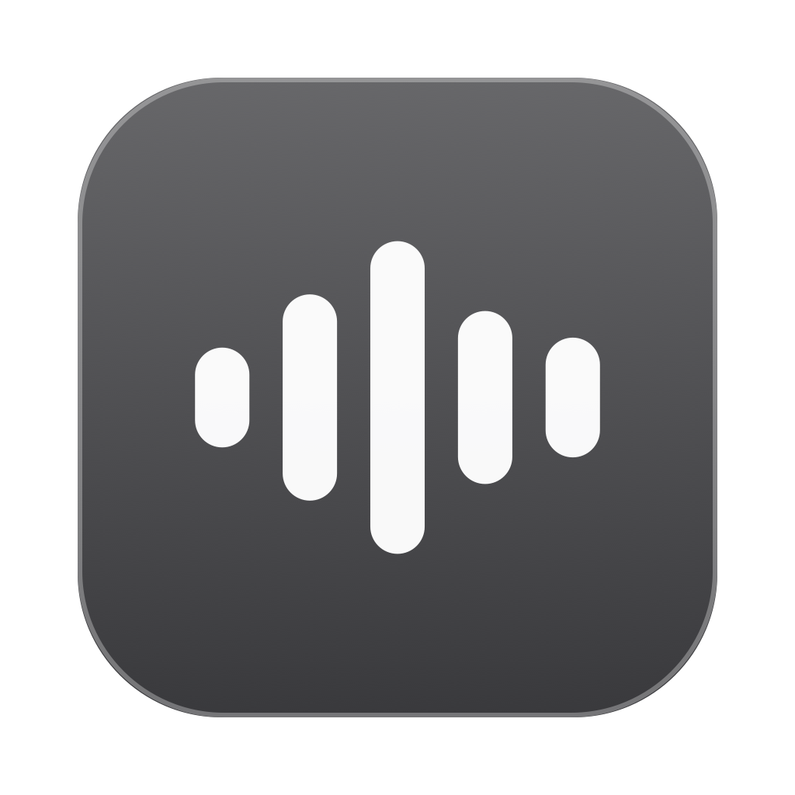
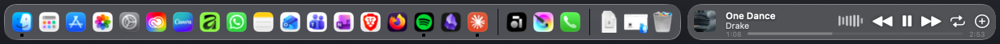

# DockTunes

*[English version](README.md)*

Ein Spotify-Panel, das sich neben das Dock legt und ihm folgt – als wäre es
Teil davon.





Zeigt Cover, Titel und Interpret des laufenden Songs, hat Wiedergabetasten,
eine Zeitleiste mit laufender Zeit, eine Tonanzeige, die auf das echte
Ausgabesignal reagiert, und kann den Song in eine Playlist legen. Auf Wunsch
zeigt es statt Cover und Titel den mitlaufenden Liedtext.

## Voraussetzungen

- macOS 14.2 oder neuer (Liquid Glass ab macOS 26, sonst eine Rückfallebene)
- Spotify-Desktop-App
- Xcode Command Line Tools (`xcode-select --install`) – ein Xcode-Projekt
  braucht es nicht

## Bauen und starten

```bash
git clone <repository> DockTunes
cd DockTunes
bash build.sh
open -a ~/Applications/DockTunes.app
```

`build.sh` übersetzt die Quelldatei, legt das App-Bundle in `~/Applications`
an und signiert es.

## Berechtigungen

Beim ersten Start fragt macOS nach zwei Freigaben:

1. **Bedienungshilfen** – nur damit lässt sich auslesen, wo das Dock gerade
   sitzt. Ohne sie bleibt das Panel unsichtbar. Danach die App einmal neu
   starten.
2. **Spotify steuern** – ohne sie kennt DockTunes weder Titel noch Wiedergabe.

Für die Tonanzeige kommt beim ersten Abspielen eine dritte Rückfrage
(Ton mitlesen). Sie wird nur ausgewertet, nichts aufgezeichnet oder gesendet.
Schaltet man die Tonanzeige ab, entfällt die Frage.

## Bedienung

| Aktion | Wirkung |
|---|---|
| Klick auf das Cover | den Titel in Spotify öffnen |
| Klick auf einen Interpreten | dessen Seite in Spotify öffnen |
| Zeiger auf der Interpretenzeile | hält beide Lauftexte an, solange er dort steht |
| Klick sonst auf das Panel | Spotify in den Vordergrund holen |
| Knöpfe rechts | zurück, abspielen/pausieren, weiter, wiederholen |
| Pluszeichen | Song in die zuletzt gewählte Playlist legen |
| Zeiger auf dem Panel | Zeitleiste mit laufender und gesamter Spielzeit |
| Ziehen auf der Zeitleiste | im Song vor- und zurückspringen |
| Scrollen über dem Panel | Lautstärke in Fünferschritten; die Zeitleiste zeigt sie 1,4 s lang an – auch im Liedtext-Modus, dort pausiert der Text so lange. Nach oben ist lauter, unabhängig von der Systemeinstellung für die Scrollrichtung |
| Rechtsklick | Menü mit allen Einstellungen |

Unter dem Titel stehen alle Interpreten, nicht nur der erste. Das geht nur mit
verbundener Web-Schnittstelle: Spotifys Skriptzugang kennt `artist` bloß in der
Einzahl und gibt dort den ersten Namen zurück. Bei *Rich Baby Daddy (feat.
Sexyy Red & SZA)* steht dort schlicht `Drake`, während Spotify selbst `Drake,
Sexyy Red, SZA` führt. Ohne Verbindung bleibt es beim ersten Namen.

Das Cover führt zum Titel selbst, jeder Name zur Seite des Interpreten.
Beides rührt die Wiedergabe nicht an – nachgemessen: beim Öffnen des Titels
lief der Song ungestört von 0:26 auf 0:47 weiter, Spotify wechselte nur die
Ansicht. Bei eigenen Dateien gibt es keine solche Seite; dort bleibt es beim
blossen Nach-vorn-Holen.
Welcher gerade unter dem Zeiger liegt, zeigt eine Unterstreichung. Eine
Zeigerhand gibt es nicht: den Mauszeiger vergibt nur die Anwendung im
Vordergrund, und dorthin kommt das Panel nie – dasselbe Hindernis wie beim
Größenziehen, siehe unten.

Nachgefragt wird höchstens einmal je Titel, das Ergebnis bleibt gespeichert –
auch ein einzelner Name, sonst stellte die App dieselbe Frage bei jedem
Auslesen neu. Nach drei Fehlschlägen ist Ruhe. Gesucht wird der Liedtext
weiterhin unter dem Hauptinterpreten allein: lrclib führt die Titel unter
diesem einen Namen, eine Aufzählung findet dort nichts.

## Breite

Die Breite ist **fest** und wird nicht vom Titel bestimmt. Eine mitwandernde
Breite wäre bei jedem Lied eine andere, und das Panel wäre ständig in Bewegung.

Eingestellt wird sie im Rechtsklick-Menü unter **Breite**, in sechs Stufen
(Winzig, Mini, dann 250 / 380 / 520 / 640; im Liedtext-Modus 420 / 520 / 640 /
760). Die Stufen sind nicht rund gewählt, sondern an den Inhalt gekoppelt:
jede bringt etwas Sichtbares mehr. Normal- und Liedtext-Modus haben eigene
Stufen. Zwischenwerte über `panelWidth` und `lyricsWidth`, siehe Einstellungen.

Auf beide rastet das Panel auch von selbst ein, wenn der Dock breiter wird und
den Platz wegnimmt: sobald Titel und Interpret nicht mehr hineinpassen, wird es
auf die Mini-Breite gestaucht, und reicht auch die nicht, auf Winzig. Ohne das
blieb es in voller Restbreite stehen, und Cover und Tasten schwammen mit einer
Handbreit Luft darin – der Platz war ja reserviert, nur nichts mehr da, was
hineingehört. Nachgeprüft: mit zwei zusätzlich gestarteten Programmen wuchs der
Dock von 1056 auf 1134 Punkte, und das Panel ging von 216 auf 102.

**Winzig** zeigt nur Abspielen/Pause und Weiter, **Mini** dazu das Cover –
gedacht für den Laptop unterwegs, wo neben dem Dock wenig Platz ist und jede
Zeichenfläche Strom kostet. Beide zeigen beim Zeigen weiterhin die Zeitleiste,
nur ohne die beiden Zeitangaben und dafür über die volle Breite. Ihre Zahlen
stehen nicht fest, sondern werden beim Aufklappen des Menüs ausgerechnet: die
Cover-Größe hängt an der Dock-Höhe, und eine feste Zahl wäre bei einem größeren
Dock zu knapp – dann fiele genau das Cover weg, das Mini ausmacht. Bei
Dock-Höhe 51 sind es 73 und 110 Punkte.

In beiden rücken die Tasten enger zusammen als im vollen Panel: 8 statt 12
Punkte Abstand, und der Abstand, den die Reihe sonst nach links freihält, fällt
weg – links steht ja nichts. Der Abstand vom Cover zur ersten Taste ist auf 4
gesetzt und nicht auf die üblichen 10, weil der Tastenrahmen rund neun Punkte
eigenen Innenrand mitbringt; sichtbar sind es damit dieselben rund dreizehn wie
zwischen den beiden Tasten.

**Je breiter, desto mehr steht drin:**

| ab | kommt dazu |
|---|---|
| 73 | Abspielen/Pause und Weiter, mittig (Winzig) |
| 110 | Cover (Mini) |
| 200 | Titel und Interpret |
| 240 | Tonanzeige (wenn im Menü eingeschaltet) |
| 300 | Zurück |
| 360 | Playlist-Knopf |
| 380 | Wiederholen |
| 520 | Album, und Zeitleiste samt Zeiten dauerhaft statt nur beim Zeigen |
| 700 | im Liedtext-Modus: die nächste Zeile als Vorschau |

Die Reihenfolge folgt dem Nutzen: **weiter** ist wichtiger als zurück, und
beides wichtiger als das Plus – im schmalsten Panel steht deshalb die
Weiter-Taste, nicht der Playlist-Knopf.

Weggelassen wird in dieser Reihenfolge: Wiederholen, Plus, **Tonanzeige**,
Zurück, Text, Cover. Die Tonanzeige weicht vor dem Text, weil sie Zierde ist
und der Titel der Inhalt – stand sie dahinter, verschwand bei 216 Punkten der
Text, obwohl er ohne sie bequem passte. Es gibt dabei keine gesetzten
Schwellen: gerechnet wird, was hineinpasst, und die Zahlen in der Tabelle sind
das Ergebnis, nicht die Vorgabe.

Der **Wiederholen-Knopf** steht ab der Normalgröße und schaltet in drei
Stufen weiter:

| Klick | Zustand | Symbol |
|---|---|---|
| – | aus | gedimmt |
| 1× | alle wiederholen | hell |
| 2× | **einzeln** wiederholen | hell, mit der 1 im Symbol |
| 3× | wieder aus | gedimmt |

Aus wird gedimmt gezeigt statt ausgeblendet – so bleibt sichtbar, dass es die
Wahl gibt. Der Knopf nimmt dem Titel 38 Punkte weg; bei der Normalgröße
bleiben dem Text rund 120, und was nicht hineinpasst, läuft durch.

Die **Tonanzeige** läuft auch im schmalen Panel. Ob sie überhaupt erscheint,
entscheidet der Schalter im Rechtsklick-Menü; sie weicht nur, wenn dem Titel
sonst weniger als 70 Punkte blieben – der Text wäre dort nur noch ein hastig
laufender Schnipsel. Die Schwelle hängt an der Panelbreite und daran, welche
Knöpfe stehen, **nicht** am Titel: sonst ginge die Anzeige bei jedem Lied an
und aus.

**Passt der Titel nicht, läuft er durch** – endlos, mit 20 Punkten je Sekunde
und 40 Punkten Abstand zwischen den Durchläufen. Jeder Durchlauf beginnt mit
2,5 Sekunden Stillstand, damit sich der Anfang lesen lässt. Nur der Titel; der
Interpret wird weiterhin gekürzt, und im Liedtext-Modus bricht die Zeile um
statt zu wandern.

Normal- und Liedtext-Modus merken sich ihre Breite getrennt – der Liedtext
braucht mehr Platz als Cover, Titel und Knöpfe.

## Liedtext

Im Rechtsklick-Menü einschaltbar. Statt Cover und Titel zeigt das Panel dann
die laufende Textzeile und darunter die nächste.

Es steht immer nur die **laufende** Zeile da, dafür über zwei Zeilen, wenn sie
nicht auf eine passt. Die abgeschwächte Vorschau auf die nächste Zeile ist
entfallen: lange Zeilen wurden dadurch abgeschnitten, und das Kommende ist
weniger wert als das Laufende vollständig. Reichen zwei Zeilen nicht, wird
sichtbar gekürzt statt stillschweigend abgeschnitten.

Beim Zeilenwechsel steigt die neue Zeile ein und blendet auf (260 ms) – sonst
steht der Text plötzlich anders da und der Wechsel geht unter.

Vor der ersten Zeile und in Instrumentalpausen stehen Titel und Interpret
statt einer leeren Fläche.

Ab 700 Punkten Breite steht die nächste Zeile wieder darunter – dort nimmt sie
der laufenden nichts weg. Die Breite lässt sich ziehen oder im Rechtsklick-Menü
in vier Stufen wählen.

Die Texte kommen von [lrclib.net](https://lrclib.net), einem offenen
Verzeichnis ohne Anmeldung. Dorthin gehen Titel und Interpret des laufenden
Songs – sonst nichts.

Die Zeitmarken sind **zeilenweise**, nicht wortweise – ein Karaoke-Modus mit
mitwanderndem Wort ließe sich daraus nur schätzen. Siehe „Was nicht geht".

Eine Fassung wird nur übernommen, wenn Laufzeit (auf 4 Sekunden genau) **und**
Interpret passen. Beides als Bedingung, nicht nur als Reihung – sonst landet
ein gleichnamiges Stück eines anderen Künstlers im Panel. Passt keine Fassung,
bleibt es bei Titel und Interpret.

## Playlists

Der Knopf mit dem Pluszeichen öffnet die Auswahl – immer, nicht nur beim ersten
Mal. Eine gemerkte Standardliste gibt es bewusst nicht: ohne Auswahl weiß
niemand, wohin der Titel wandert, und die zuletzt benutzte ist selten die
gewollte. Nach dem Hinzufügen steht der Name der Liste kurz in der Unterzeile. Die Auswahl ist ein eigenes Fenster mit Suchfeld; Playlists lassen
sich über den Stern zu Favoriten machen, die dann oben stehen. Gezeigt werden
nur Playlists, in die sich auch schreiben lässt – `me/playlists` liefert auch
alle gefolgten zurück, und dort antwortet Spotify beim Hinzufügen mit 403.
(An einem echten Konto gemessen: 12 von 23 Einträgen waren fremd.)

Das geht nicht über AppleScript – Spotify kennt dafür keinen Befehl – sondern
über Spotifys Web-Schnittstelle. Sie verlangt eine einmalige Einrichtung:

1. Auf [developer.spotify.com](https://developer.spotify.com/dashboard) eine
   App anlegen (kostenlos)
2. Als Redirect URI genau `http://127.0.0.1:8888/callback` eintragen
3. **Settings → User Management → sich selbst eintragen**, mit Namen und der
   E-Mail des eigenen Spotify-Kontos
4. Client-ID kopieren und beim ersten Klick auf das Pluszeichen einsetzen

Schritt 3 ist leicht zu übersehen und eine mögliche Ursache für
„Titel konnte nicht hinzugefügt werden – Fehler 403".

## Der Pfad heißt `/items`, nicht `/tracks`

Ein 403 beim Hinzufügen hat noch eine zweite, viel unauffälligere Ursache, und
die hat hier Stunden gekostet: **Spotify weist den dokumentierten Pfad
`/playlists/{id}/tracks` inzwischen mit 403 ab.** Der Nachfolger `/items`
antwortet normal – gleicher Zugang, gleiche Playlist, gleicher Rumpf:

| Aufruf | |
|---|---|
| `GET /me` | 200 |
| `GET /me/playlists` | 200 |
| `GET /playlists/{id}` | 200 |
| `GET /search`, `/tracks`, `/albums` | 200 |
| `GET /playlists/{id}/tracks` | **403** |
| `POST /playlists/{id}/tracks` | **403** |
| `GET /playlists/{id}/items` | **200** |
| `POST /playlists/{id}/items` | **201** |

Weil alles andere normal antwortete, sah der Fehler nach einer fehlenden
Berechtigung aus – die Berechtigungen waren aber korrekt erteilt (Spotify
selbst nennt sie beim Erneuern des Zugangs), die Playlist war die eigene, und
auch eine ganz frische Anmeldung änderte nichts.

Beim Entfernen ist der Rumpf ebenfalls anders: `{"items": [{"uri": …}]}`
statt `{"tracks": […]}`.

Angemeldet wird per PKCE, es liegt also kein Geheimnis in der App. Die
Zugangsdaten landen in `~/Library/Application Support/DockTunes/credentials.json`
mit Rechten 0600.

Die Datei wird bewusst **ohne** `.completeFileProtection` geschrieben. Diese
Schutzklasse stammt aus der iOS-Welt und macht die Datei auf macOS unlesbar –
nachgemessen wurde sie danach selbst für die App und für den Eigentümer mit
„Operation not permitted" abgewiesen, obwohl die Rechte 0600 lauteten. Der
Schutz sind hier die Dateirechte.

## Einstellungen

Alles über das Rechtsklick-Menü. Zusätzlich per `defaults`:

```bash
defaults write de.jancko.docktunes volumeStep -int 2      # Lautstärke je Raste (Vorgabe 5)
defaults write de.jancko.docktunes volumeScrollPoints -float 3   # Wischweg je Lautstärkepunkt (Vorgabe 1,5)
defaults write de.jancko.docktunes followRate -int 30     # Abfragen je Sekunde
defaults write de.jancko.docktunes rimAlpha -float 0.30   # Stärke der Lichtkante
defaults write de.jancko.docktunes shadowStrength -float 0.6 # Schatten, 0 = aus
defaults write de.jancko.docktunes panelWidth -float 460  # Breite, normal (ab 200)
defaults write de.jancko.docktunes lyricsWidth -float 580 # Breite im Liedtext-Modus
```

---

# Technische Notizen

Die folgenden Abschnitte dokumentieren Entscheidungen, die beim Nachbauen sonst
wie Willkür wirken. Alle Zahlen sind nachgemessen, nicht geschätzt.

## Verhalten

Das Panel folgt der Position des Docks:

- Abgefragt wird 60-mal je Sekunde, solange der Zeiger beim Dock ist – nur dann
  ändert sich dessen Größe (Vergrößerung, Ein- und Ausfahren). Sonst fünfmal.
  Nachgemessen: die Lücke zwischen Dock und Panel bleibt während der
  Vergrößerung konstant. Einstellbar mit
  `defaults write de.jancko.docktunes followRate -int 30`.
- Es sitzt immer rechts neben dem Dock, exakt in dessen Höhe. Das sichtbare
  Dock-Glas liegt 5 Punkte tiefer als die Symbolliste, die die Bedienungshilfen
  melden – dieser Versatz ist eingerechnet und bei Dock-Größe 35, 50 und 70
  nachgemessen. Passt das Panel rechts nicht hin, weicht es nach links aus.
- Bewegungen laufen weich aus (rund 80 ms), größere Sprünge werden sofort
  gesetzt, damit ein Bildschirmwechsel nicht über den Schreibtisch fliegt.
- Die Füllung ist gegen den Dock ausgemessen, nicht geschätzt. Der Dock mischt
  streng linear – Helligkeit = 0,660 · Grund + 58 im Hell-, 0,720 · Grund + 17
  im Dunkelmodus, über Prüfflächen von Schwarz bis Weiß ohne Abweichung.
  Liquid Glass tut das nicht: es hellt sich über halbheller Fläche selbsttätig
  auf und kippt über sehr heller ins Dunkle. Wie das Panel den Dock trotzdem
  trifft, steht im Quelltext bei `applyFill`. Größte verbleibende Abweichung:
  4 von 255 Stufen im Hell-, 6 im Dunkelmodus.
- Die helle Kante läuft oben **und** unten, je einen Punkt, an den Seiten nur
  angedeutet – so wie beim Dock (gemessen 140 gegen 88 Fläche). Trifft auf
  0,5 Stufen. Feinjustage: `defaults write de.jancko.docktunes rimAlpha -float 0.30`.
- Kein Schlagschatten. Der Dock wirft keinen: der Grund neben ihm misst exakt
  den Wert des Hintergrunds. Mit Schatten saß das Panel sichtbar *auf* dem
  Bild statt darin.
- **Schatten hinter Text und Knöpfen.** Nicht Zierde, sondern das, was die
  Lesbarkeit trägt: über einem hellen Fenster hinter dem Dock steht weißer Text
  auf einer Fläche von 221 – gemessene **34 Stufen** Eigenkontrast, das reicht
  nicht. Der Schatten legt dort 60 Stufen dazu. Über einem dunklen
  Schreibtischbild ist er dagegen kaum zu sehen (Fläche 82, Halo 23).
  Die Stärke lag früher bei 1,0, was über dunklem Grund unnötig prägnant war;
  jetzt 0,6. Alles zusammen einstellbar:
  `defaults write de.jancko.docktunes shadowStrength -float 0` schaltet sie ab.
  Die Zeitangaben hatten als einzige gar keinen – sie haben jetzt denselben.
- Die Textfarbe hängt bewusst **nicht** am Systemmodus: Wie hell die Panelfläche
  ist, bestimmt der Hintergrund dahinter (gemessen 0,21 über Schwarz bis 0,88
  über Weiß), nicht Hell- oder Dunkelmodus. Heller Text mit Schatten trägt auf
  beidem. Über einem sehr hellen Fenster direkt hinter dem Dock bleibt er
  grenzwertig – ein Kompromiss zugunsten der Dock-Optik.
- Es wächst und wandert mit, wenn sich die Dock-Breite ändert.
- Verschwindet das Dock (Vollbild, automatisches Ausblenden), verschwindet das
  Panel mit. **Beim Wechsel zwischen Bildschirmen aber nicht**: der Dock meldet
  dabei kurz ein Rechteck, das auf keinen Bildschirm passt (nachgelesen im
  Protokoll: `779,-51`, `3019,97`, `774,-36`). Früher wurde das Panel deshalb
  aus- und einen Wimpernschlag später wieder eingeblendet – das war das kurze
  Aufblitzen. Jetzt bleibt es stehen, bis der Dock wieder auf einem Schirm
  sitzt. Nachgemessen an einer Bildschirmaufnahme über gleichmäßigem Grund:
  die Fläche springt von 71 (Hintergrund) unmittelbar auf ihren Endwert 106,7
  und bleibt dort, ohne ein einziges helleres Bild dazwischen.
- Es ist auf allen Schreibtischen sichtbar und liegt auf derselben
  Fensterebene wie das Dock.
- Ohne laufendes Spotify oder ohne geladenen Titel bleibt es unsichtbar.

Klicks auf das Panel holen die App nicht in den Vordergrund – das Fenster, in
dem gerade gearbeitet wird, behält den Fokus.

## Rechenzeit

Gemessen mit `top -l 5` auf einem Kern. (`ps -o %cpu` taugt hier nicht – das
ist der Durchschnitt über die ganze Laufzeit, nicht der aktuelle Wert.)

| Zustand | ganz früher | zwischendurch | jetzt |
|---|---|---|---|
| pausiert, Zeiger woanders | 4,0 % | 0,9 % | **0,3 %** |
| spielt, Zeiger woanders | 7,6 % | 2,2 % | **1,4 %** |
| spielt, Zeiger auf dem Panel | 9,3 % | 2,8 % | **2,1 %** |
| Liedtext-Modus, spielt | – | 2,5 % | **2,4 %** |
| spielt, Tonanzeige aus | – | – | **0,3 %** |

Speicher 13–15 MB frisch gestartet und über 90 Sekunden unverändert. Nach
zehn gehörten Titeln sind es 26 MB statt vorher 34 – siehe die verkleinerten
Cover unten. Lecks: 9,6 KB in Apples XPC-Schicht, dazu 4 KB in
LaunchServices, sobald ein Link geöffnet wurde. Beides gehört Apple, im
eigenen Code steckt keines.

Zwei Werte kommen dazu, die es früher nicht gab. Sie hängen daran, wie weit
der Zeiger vom Dock entfernt ist, und wurden auf demselben Titel an derselben
Stelle gemessen, weil die Tonanzeige nur bei sichtbarer Änderung neu zeichnet
und die Last damit am Musikstück hängt:

| Zustand | vorher | jetzt |
|---|---|---|
| Zeiger wandert am Dock entlang | 2,72 % | **0,95 %** |
| Zeiger wandert über das Panel | 9,7 % | 9,7 % |

Der zweite Wert ist nicht unserer: an ihm hängt eine fremde App. Siehe unten.

Woher die Ersparnis kommt:

- **Zeichnen im Glas ist teuer.** Jedes `draw(_:)` in einer
  `NSGlassEffectView` lässt die ganze Fläche neu mischen – gemessen 1,7 ms je
  Durchlauf. Die Tonanzeige tat das 30-mal je Sekunde, die Zeitleiste 10-mal.
  Beide bestehen jetzt aus `CALayer`n: nur noch Höhe und Deckkraft setzen,
  den Rest macht der Compositor. Das allein waren knapp 5 Prozentpunkte.
- **Die Dock-Abfrage läuft nur, wenn sie etwas erfahren kann.** Der Dock
  ändert seine Größe nur, wenn der Zeiger bei ihm ist (Vergrößerung) oder er
  ein- und ausfährt. Sonst genügen fünf Blicke je Sekunde statt sechzig. Die
  Zeigerposition abzufragen kostet nichts, die Bedienungshilfen 0,06 ms – bei
  60 Hz sind das 2 % Dauerlast.
- **Der schnelle Takt läuft nur, wenn der Dock überhaupt reagieren kann.**
  Er ändert seine Größe beim Vergrößern und beim Ein- und Ausfahren – sonst
  nie. Ist das Ausblenden aus und die Vergrößerung entweder aus oder auf
  dieselbe Größe gestellt, bewirkt Zeigernähe gar nichts, und die 60 Hz sind
  reine Verschwendung. Genau dieser Fall stand auf dem Entwicklungsrechner:
  Vergrößerung an, aber `largesize` gleich `tilesize`, beide 38. Gelesen wird
  das aus `com.apple.dock`, beim Start, einmal je Minute und auf die Meldung
  `com.apple.dock.prefchanged` hin. Ergebnis 2,72 % → 0,95 %, sobald der
  Zeiger in die Nähe des Docks kommt – und das tut er ständig, das Beobachtungs-
  band ist 180 Punkte breit.
- **Der Mitschnitt läuft nur bei sichtbarer Tonanzeige.** Er hing bisher am
  Schalter im Menü, nicht daran, ob die Anzeige tatsächlich im Bild steht. In
  den kleinen Breiten ist für sie kein Platz, im Vollbild ist das ganze Panel
  weg – gerechnet wurde trotzdem. Auf dem Entwicklungsrechner, wo neben dem
  breiten Dock nur 216 Punkte bleiben und die Anzeige nirgends hinpasst:
  **1,67 % → 0,19 %**, auf demselben Titel an derselben Stelle gemessen. Am
  Laptop ist Vollbild der Normalfall, nicht die Ausnahme.
- **Ohne sichtbares Panel wird auch die Position nicht mehr abgefragt.** Der
  Volltakt alle 60 Sekunden und Spotifys eigene Meldung genügen dann; beim
  Wiederauftauchen wird einmal frisch geholt, damit die Leiste nicht mit einem
  alten Stand aufblendet.
- **Im Stromsparmodus halbieren sich die Takte.** Tonanzeige 24 → 12 Bilder,
  Nachführen 12 → 8 Blicke je Sekunde. Das System hält Hintergrundarbeit dann
  ohnehin zurück; ein Panel neben dem Dock hat erst recht keinen Anspruch.
- **Cover werden verkleinert gespeichert.** Spotify liefert 640×640; gezeigt
  werden sie auf 34 Punkten. Einmal gezeichnet hält `NSImage` die entpackte
  Fläche fest, gut anderthalb Megabyte je Bild. Jetzt wandern sie als 256×256
  in den Speicher, 256 KB. Nach zehn Titeln gemessen: 34 MB → 26 MB.
- **Unsichtbares wird nicht gerechnet.** Zeitleiste und Zeiten erscheinen erst
  beim Hovern; ohne Zeiger auf dem Panel läuft der Takt gar nicht. Die Leiste
  wird nur neu gesetzt, wenn sie sich um mindestens einen Punkt bewegt – bei
  drei Minuten Spielzeit ist das etwa alle anderthalb Sekunden statt zehnmal
  je Sekunde.
- **Text nur bei echter Änderung.** Im Liedtext-Modus lief `setTexts` zehnmal
  je Sekunde und baute jedes Mal zwei Attributtexte samt Schatten neu auf,
  obwohl die Zeile alle paar Sekunden wechselt.
- **Der Abfragetakt richtet sich nach dem Zustand.** Ein Abruf über AppleScript
  kostet 55 ms. Während der Wiedergabe alle 5 Sekunden, bei Pause alle 20 –
  da bewegt sich nichts, und einen echten Wechsel meldet Spotify von selbst.
- **Feste Puffer in der Tonanalyse** statt vier neuer Anlagen je Durchlauf, und
  der Ringspeicher wird blockweise kopiert statt Wert für Wert mit Modulo.
- **Der Dock wird nur beobachtet, wenn sich etwas ändern kann.** Der Taktgeber
  selbst kostet: bei 60 Hz gemessen 0,6 Prozentpunkte mehr als bei 15, auch
  wenn der Durchlauf nichts tut. Voll läuft er deshalb nur, solange der Zeiger
  beim Dock steht – nur dann kann sich dessen Größe ändern. Sonst zwölfmal je
  Sekunde. Nachgemessen: die Vergrößerung wird trotzdem binnen 0,3 Sekunden
  nachgezogen.
- **Der häufige Abruf holt nur noch die Position.** Der volle Abruf über
  AppleScript kostet 60 ms, einer nur für Position und Zustand 15 – gemessen an
  je zwölf Durchläufen. Mehr wird zum Nachziehen nicht gebraucht; Titelwechsel
  und Start/Stopp meldet Spotify von selbst. Ein voller Abruf läuft als
  Rückfallebene alle 60 Sekunden.
- **Und nur, wenn die Position überhaupt zu sehen ist.** Sie steht in der
  Zeitleiste, und die erscheint beim Zeigen, bei großer Breite und im
  Liedtext-Modus. Sonst genügen 15 Sekunden statt 5.
- **Die Breite wird gemerkt.** Sie hängt an einer Einstellung, am Modus und am
  Platz neben dem Dock – nichts davon ändert sich zwischen zwei Takten. Sie bei
  jeder Abfrage neu zu holen hieß: einmal in die Einstellungen und einmal durch
  alle Bildschirme, sechzigmal je Sekunde.
- **Die Tonanzeige läuft mit 24 statt 30 Bildern je Sekunde** und überspringt
  Durchläufe, bei denen sich weder Höhe noch Deckkraft sichtbar ändern. Der
  Mitschnitt selbst kostet 0,4 %, jedes weitere Bild je Sekunde 0,035.
- **Die Symbolliste des Docks wird gemerkt.** Sie bei jedem Durchlauf unter
  den Kindern zu suchen heißt: ein Feld anlegen und für jedes Kind die Rolle
  erfragen, jede Abfrage ein eigener Aufruf an den Dock-Prozess. Eine
  Stichprobe im Leerlauf zeigte rund 2 ms je Durchlauf und damit den größten
  Posten überhaupt – bei nur fünf Abfragen je Sekunde. Mit gemerkter Liste
  bleiben zwei Abfragen, und der Leerlauf fiel von 2,2 % auf 0,9 %.

### Was nichts brachte

Der Vollständigkeit halber, damit es niemand ein zweites Mal versucht:

- **Zeigerbewegungen abschalten.** Die zehn Prozent, die anfallen, während der
  Zeiger über das Panel wandert, sind nicht unsere. Mit abgeschalteter
  Bewegungszustellung waren es 9,88 %, mit eingeschalteter 9,72 % – innerhalb
  der Streuung dasselbe. `sample` zeigt, wohin sie gehen: 5,6 % der Proben
  stehen in `_XCopyElementAtPosition`, einer **eingehenden** Anfrage der
  Bedienungshilfen. Ein anderes Programm fragt bei jeder Zeigerbewegung
  „welches Element liegt hier?", und AppKits Antwort kostet das. Auf dem
  Entwicklungsrechner ist DockDoor der wahrscheinliche Fragesteller – es
  verfolgt den Zeiger am Dock, und dort steht unser Panel.
- **Die Textfelder aus den Bedienungshilfen nehmen**, um jene Anfragen billiger
  zu beantworten: 10,88 % mit und ohne. Der Aufwand steckt in AppKits
  Maschinerie, nicht im Absteigen in unsere Felder. Zurückgenommen – für nichts
  wollte ich die Bedienungshilfen nicht verschlechtern.
- **Eigene URLSession ohne HTTP-Zwischenspeicher** für die Cover: 26 MB mit und
  ohne. Auch zurückgenommen.
- **Die Meldung von Spotify drosseln.** `PlaybackStateChanged` kam in 25
  Sekunden laufender Wiedergabe **null**-mal; Spotify meldet nur echte
  Wechsel. Da ist nichts zu drosseln.

### Eine Falle beim Umbau

`setFollowRate` schaltet den bestehenden Takt ab und legt einen neuen an. Wird
es aufgerufen, **bevor** der Takt überhaupt existiert, läuft es ins Leere: der
neu angelegte Takt wird von der nächsten Zeile überschrieben, ohne abgeschaltet
zu werden, und läuft unsichtbar weiter. Schlimmer noch stand `fastFollow`
danach auf `false`, während der sichtbare Takt mit 60 Hz lief – die Prüfung
`guard fast != fastFollow` schaltete ihn nie herunter. Kostenpunkt 0,8
Prozentpunkte im Leerlauf, gefunden nur, weil die Fassung nach dem Optimieren
**schlechter** maß als vorher. Deshalb wird jede Änderung hier gegen die
vorherige gemessen, auf demselben Titel an derselben Stelle.
- **Der Dock-Prozess wird nicht mehr gesucht.** Ihn alle zwei Sekunden in der
  Prozessliste zu finden war im Leerlauf der größte verbliebene Posten – eine
  Stichprobe zeigte den Löwenanteil der Ruhelast genau dort. Er wechselt aber
  praktisch nie; jetzt wird er behalten und erst verworfen, wenn die Abfrage
  fehlschlägt, also nach einem Neustart des Docks.
- **Die Tonanzeige setzt je Bild nur noch Höhe und Deckkraft.** Farbe und
  Eckenrundung hängen nicht am Pegel und wurden trotzdem dreißigmal je Sekunde
  neu gesetzt – jede Farbe kostete dabei ein neues `CGColor`, siebenmal je
  Bild.
- **Der Lauftext hält zwischen den Durchläufen an.** Solange sich nichts
  bewegt, muss die Glasfläche auch nicht neu gemischt werden. Zusammen mit dem
  langsameren Lauf ist er aus der Messung praktisch verschwunden.

Frühere Runde: der Dock-Prozess wird nur alle zwei Sekunden gesucht (die
Prozessliste zu durchsuchen kostete 0,2 ms je Takt), und hat sich die
Dock-Geometrie nicht geändert, bricht der Durchlauf sofort ab. Das brachte
21 % auf 4 %.

## Maßraster

Alle Abstände im Panel folgen zwei Werten: 8 Punkte nach außen, 10 Punkte
zwischen den Elementen (Knöpfe untereinander 4).

Die Panelbreite richtet sich nach dem Inhalt. Bei fester Breite entstand
zwischen Titel und Tonanzeige eine Lücke, die je nach Titellänge anders ausfiel –
die Abstände waren damit nicht gesetzt, sondern zufällig.

Die Zeitleiste zeigt links die laufende, rechts die gesamte Spielzeit – beide
mit fester Breite, damit die Leiste beim Ticken nicht wandert.

## Abstände im Panel, nachgemessen

| Strecke | Wert |
|---|---|
| Cover → Titel | 12 px |
| Titel → Tonanzeige | 11–12 px |
| Tonanzeige → erster Knopf | 12 px |
| Knopf → Knopf | 12 px |

Die Knöpfe sitzen **nicht** in gleich breiten Rahmen. Ihre Symbole sind
unterschiedlich breit (24, 13, 24 und 18 px) und tragen zudem ungleiche Ränder –
der Zurück-Pfeil etwa 0 px links und 2 px rechts. Gleiche Rahmen ergeben damit
sichtbar ungleiche Abstände (gemessen 13, 12 und 8 px). Die App misst deshalb
beim Start die tatsächlich bemalte Fläche jedes Symbols und richtet die Rahmen
daran aus; die verbleibenden ein bis zwei Punkte sind als Festwerte im Code
ausgeglichen und dort begründet.

Gemessen wird mit zwei Schwellen: Bei voller Deckung liegen alle
Knopfabstände auf 12 px, zählt man die weichen Antialiasing-Ränder mit, streuen
sie um einen Punkt. Enger geht es auf einem Punktraster nicht.

## Zeitleiste, nachgemessen

| Strecke | Wert |
|---|---|
| laufende Zeit → Leiste | 8 px |
| Leiste → Gesamtzeit | 8 px |
| Gesamtzeit → Panelrand | 11 px |

Die Zeitfelder bekommen beide die Breite des breiteren Textes; feste Felder
ließen dort Luft, wo der Text schmaler war, und rückten die Leiste sichtbar aus
der Mitte. Die linke Zeit ist rechtsbündig, damit sie an der Leiste anliegt.

Ziffern tragen unterschiedlich viel Tinte an ihren Rändern – gleiche gesetzte
Abstände wirken deshalb um einen Punkt ungleich. Der rechte Abstand ist um
diesen Punkt korrigiert; nachgeprüft bei 0:15, 0:49, 1:15 und 1:43, überall
8 zu 8 Pixel.

Der Strich sitzt mittig in seinem Feld, damit er auf einer Linie mit den Zeiten
liegt statt darüber zu schweben.

## Liedtext-Modus, nachgemessen

Dieselben Werte wie im normalen Modus:

| Strecke | Wert |
|---|---|
| laufende Zeit → Leiste | 8 px |
| Leiste → Gesamtzeit | 8 px |
| Panelrand → laufende Zeit | 11 px |
| Gesamtzeit → Panelrand | 11 px |
| Tonanzeige → erster Knopf | 12 px |
| Knopf → Knopf | 12 px |

Play und Pause sind unterschiedlich geformt und brauchen je einen eigenen
Feinversatz – mit einem gemeinsamen Wert lag der Abstand beim Pause-Zeichen um
einen Punkt daneben.

## Signatur

`build.sh` signiert ad-hoc, wenn kein eigenes Zertifikat da ist. Das genügt zum
Ausprobieren, hat aber einen Haken: Eine Ad-hoc-Signatur bekommt bei jedem Bauen
eine neue Kennung, und macOS verlangt danach jedes Mal die Freigaben von vorn.

Wer öfter baut, legt sich einmalig ein eigenes selbstsigniertes Zertifikat mit
dem Namen `Jancko DockTunes Signing` im Schlüsselbund an (Schlüsselbundverwaltung
→ Zertifikatsassistent → Zertifikat erstellen, Art „Codesignatur"). `build.sh`
findet es dann von selbst, die Kennung bleibt stabil und die Freigaben halten.

Ein Zertifikat liegt aus naheliegenden Gründen nicht im Repository.

## Fehlersuche

Die App schreibt ihren Zustand nach `/tmp/docktunes-status.txt` – dort steht
sofort, ob eine Freigabe fehlt, Spotify stumm bleibt oder das Dock nicht
gefunden wird.

## Einzeltitel wiederholen, selbst gemacht

„Alle wiederholen" ist Spotifys eigene Einstellung. **„Einzeln" kennt Spotify
über AppleScript nicht** – die Eigenschaft `repeating` ist ein bloßes Ja/Nein,
nachgesehen im Wörterbuch der App. Über die Web-Schnittstelle ginge es
(`state=track`), das verlangte aber eine zusätzliche Berechtigung, eine neue
Anmeldung und Spotify Premium.

Deshalb macht das Panel es selbst: **0,6 Sekunden vor Schluss zurück auf
Anfang.** Der Abstand ist mit Absicht großzügig – die Position wird zwischen
den Abrufen hochgerechnet, und zu spät wäre der nächste Titel schon dran.
Nachgemessen an einem Stück von 155,4 Sekunden: Sprung bei 154,5 zurück auf
1,1, selber Titel.

Zwei Dinge, die man dazu wissen sollte:

- Spotifys eigene Oberfläche zeigt diesen Zustand **nicht** an, sie weiß nichts
  davon. Der Zustand steht in den Einstellungen (`repeatOne`) und übersteht
  einen Neustart.
- Die letzten 0,6 Sekunden des Stücks fallen weg. Bei einem ausklingenden
  Schluss ist das zu hören.

## Was nicht geht

**Karaoke mit mitwanderndem Wort.** Dafür bräuchte es Zeitmarken je Wort.
lrclib liefert nur je Zeile – über mehrere Titel geprüft, keine einzige
Wortmarke. Wortgenaue Daten haben Musixmatch, Apple Music und Spotify selbst,
alle drei nur über bezahlte oder nicht öffentliche Schnittstellen.

Schätzen ließe es sich (Zeilendauer auf die Wörter verteilen, nach Länge
gewichtet), aber gesungen wird nicht gleichmäßig: bei gehaltenen Tönen und
Pausen mitten in der Zeile läuft die Markierung sichtbar falsch. Das sähe nach
Karaoke aus, ohne es zu sein.

Was ehrlich ginge: ein Balken, der in der Zeilendauer einmal von links nach
rechts durch die Zeile läuft. Der stimmt an beiden Enden genau und behauptet
dazwischen nichts über einzelne Wörter.

**Die Breite mit der Maus ziehen, wie bei einem Fenster.** Probiert und wieder
ausgebaut. Das Ziehen selbst ließ sich hinbekommen (ein echter, unsichtbar
gemachter Fensterrahmen: `.titled` mit `.resizable`, dazu `canBecomeKey` und
ein überschriebenes `constrainFrameRect` – macOS schiebt Fenster mit Rahmen
sonst um 50 Punkte aus dem Dock-Bereich). Nur der Mauszeiger wechselte an der
Kante nie auf das Größensymbol, und ohne das fehlt der Hinweis, dass man dort
ziehen kann.

Acht Anläufe für den Zeiger, alle wirkungslos: `NSCursor.set()`, `push()`,
zehnmal je Sekunde nachgesetzt, für die ganze Panelfläche, per
`.cursorUpdate`-Zone, per `.mouseMoved`-Zone, auf `.floating` statt Dock-Ebene,
und mit aktivierter App. Den Zeiger vergibt die aktive Anwendung, und DockTunes
aktiviert sich nie – Klicks aufs Panel sollen den Fokus nicht stehlen.
`mouseEntered` erreicht ein Fenster ohne Fokus noch, `cursorUpdate` nicht mehr.

Nachtrag: `mouseMoved` stand hier ebenfalls als unerreichbar – das war falsch.
Die Zone braucht nur die Angabe `.mouseMoved`, und das Fenster muss
`acceptsMouseMovedEvents` gesetzt haben; dann kommen die Bewegungen auch ohne
Fokus an. Genau darauf sitzt jetzt die Unterstreichung der Interpreten. Am
Zeiger ändert das nichts: den vergibt weiterhin nur die aktive Anwendung.

Die vier Stufen im Menü tun dasselbe mit weniger Umstand.

## Lautstärke am Trackpad

Ein Mausrad rastet, ein Trackpad nicht: es liefert einen Strom kleiner Werte,
und das System schiebt nach dem Abheben der Finger noch einen abklingenden
Schwanz hinterher. Für eine Liste, die ausrollen soll, ist das richtig; für
einen Regler ist es falsch. Nachgemessen an einer nachgebauten Geste (Beginn,
Bewegung, Ende, Nachlauf – gepostet als `CGEvent` mit gesetzten Phasenfeldern):
nach dem Loslassen kamen noch **dreizehn** Ereignisse an, die die Lautstärke
weiter hochzogen.

- **Der Nachlauf zählt nicht mehr mit** (`momentumPhase` leer). Die Lautstärke
  bleibt stehen, wo der Finger sie gelassen hat.
- **Jede Geste fängt bei null an.** Ein angefangener Wisch, der die Schwelle
  nicht erreicht hat, zählte sonst beim nächsten mit – der erste Schritt kam
  zu früh oder ging in die falsche Richtung.
- **Nach oben ist lauter**, auch wenn im System die natürliche Scrollrichtung
  eingestellt ist (`isDirectionInvertedFromDevice`): ein Regler folgt der Hand,
  nicht der Einstellung für Textfenster.
- **Die Aufrufe an Spotify werden gedrosselt** – der erste sofort, danach
  höchstens alle 70 ms und der letzte Wert immer. Sie laufen seriell in einer
  Warteschlange, und Spotify sieht ohnehin nur den Endwert.

Zu Beginn jeder Geste wird der gemerkte Wert einmal bei Spotify nachgefragt.
Beim Zeigen geschieht das ohnehin; bleibt der Zeiger aber liegen und jemand
dreht in Spotify selbst, rechnete das Panel sonst vom alten Stand weiter.
Übernommen wird die Antwort nur, wenn sie um mehr als zwei danebenliegt –
Spotify rastet intern auf 1/64, und dieser Rückfall würde das Fünferraster
zerlegen – und nur, wenn zwischenzeitlich nicht selbst gedreht wurde.

Die Empfindlichkeit steht bei anderthalb Punkten Wischweg je Lautstärkepunkt.
Ich hatte sie testweise auf sechs gestellt, weil die nachgebaute Geste den
Regler über den ganzen Weg zog – am echten Trackpad war das Ergebnis träge.
Die nachgebaute Geste war offenbar länger als ein wirklicher Wisch. Wer es
anders mag, stellt `volumeScrollPoints`.

## Am Dock kleben

Der Dock ändert sich nicht nur, wenn der Zeiger bei ihm steht. Er wird breiter
und schmaler, wenn ein Programm startet oder sich beendet, und er wandert beim
Bildschirmwechsel – beides mit einer Animation, beides ohne Zeiger in der Nähe.
Für diese Fälle gab es keinen schnellen Takt: der Ruhetakt schaute viermal je
Sekunde hin, und genau so lief das Panel hinterher.

Drei Änderungen:

- **Der Ruhetakt schaut jetzt bei jedem Durchlauf hin**, also zwölfmal je
  Sekunde statt bei jedem dritten. Eine Bewegung fällt damit nach höchstens
  83 ms auf statt nach einer Viertelsekunde. Kosten: 0,07 % statt 0,02 %.
- **Bewegt sich der Dock, wird bildsynchron nachgeführt** – für 0,7 Sekunden
  nach der letzten Änderung, ganz gleich woher sie kommt. Mit einer Schwelle
  von zwei Punkten: steht die Vergrößerung auf einem Punkt Unterschied, wackelt
  der Dock beim Vorbeifahren ständig um eine Winzigkeit, und das ist nach einem
  Blick im Ruhetakt nachgezogen, ohne dass man es sieht.
- **Auf Meldung hin, bevor es losgeht.** `didLaunchApplication`,
  `didTerminateApplication`, Aus- und Einblenden sowie
  `didChangeScreenParameters` schalten den schnellen Takt vorab ein. Am
  Protokoll geprüft: beim Start von TextEdit wuchs der Dock von 1060 auf 1068
  Punkte und wieder zurück, durchgehend im schnellen Takt.

Am Zeiger hängt der schnelle Takt weiterhin nur dort, wo die Vergrößerung
tatsächlich etwas bewirkt – siehe Rechenzeit.

## Lauftext bei den Interpreten

Sind mehrere Interpreten angegeben, passt die Zeile oft nicht – dann läuft sie
durch wie der Titel, nach demselben Muster: ein Bild mit zwei Abzügen, das um
genau eine Abzugslänge wandert.

Beide Zeilen laufen **im selben Takt**: gleicher Startzeitpunkt, gleiche
Umlaufzeit. Vorher bekam jedes Band seine Bewegung dort, wo es gebaut wurde,
und weil Titel und Interpreten unterschiedlich lang sind, hatten sie
unterschiedliche Umlaufzeiten und liefen auseinander. Jetzt richtet sich der
Umlauf nach dem längeren Weg – damit wird keines schneller als die gewohnten
20 Punkte je Sekunde, das kürzere ist entsprechend langsamer unterwegs. An
neun aufeinanderfolgenden Aufnahmen gemessen: Titel 120 Punkte, Interpreten
69,5 – Verhältnis 1,73 gegenüber 1,74 aus den Bandlängen. Sie brauchen also
gleich lang.

Zwei Dinge kommen dazu, die der Titel nicht braucht:

- **Der Zeiger hält beide Bänder an.** Sonst müsste man einen wandernden Namen
  treffen. Angehalten wird, sobald der Zeiger auf der Zeile steht, nicht erst
  auf einem Namen – sonst wäre das Anhalten selbst ein Treffer, den man erst
  landen müsste. Technisch über `speed = 0` und einen festgehaltenen
  `timeOffset` der Ebene.

  **Beide**, nicht nur die untere: eines allein anzuhalten brächte sie um die
  Standzeit auseinander und stellte genau das wieder her, was der gemeinsame
  Takt beseitigt. So bleiben sie beisammen, und es gibt nie einen Rücksprung –
  sie stehen, wo sie waren, und laufen von dort weiter. Beim Fortsetzen wird
  die Standzeit aus der Ebenenzeit herausgerechnet, sonst spränge das Band um
  genau diese Spanne nach vorn. Gemessen: mit Zeiger auf der Zeile beide 0
  Punkte, danach Titel 26 und Interpreten 15 Punkte je Aufnahme – Verhältnis
  1,75 wie die Bandlängen, der Gleichlauf übersteht das Anhalten also.
- **Die Trefferzonen rechnen den Versatz mit.** Sie stehen in Textkoordinaten;
  gefragt ist die Stelle im Text, nicht im Fenster. Die tatsächliche Lage des
  Bandes steht in der **Darstellungsebene** (`presentation()`) – die
  Modellebene bliebe während der Bewegung auf ihrem Startwert stehen. Der Rest
  ist eine Modulo-Rechnung über die Abzugslänge, damit beide Abzüge dieselben
  Zonen tragen.

Wechselt die Unterstreichung, wird nur das Bild neu gezeichnet – ohne die
Bewegung anzufassen und ohne Überblendung. Sonst spränge das Band bei jedem
überfahrenen Namen an den Anfang zurück.

Kosten: 0,57 Prozentpunkte, gemessen auf demselben Titel an derselben Stelle
(1,51 % gegen 2,08 %). Sie fallen nur an, solange die Zeile tatsächlich zu lang
ist; bei einem einzelnen Interpreten läuft nichts.

## Lauftext, warum als Bild

Der durchlaufende Titel ist **ein** Bild mit zwei Abzügen des Textes, das eine
`CALayer` schiebt. Zwei Textfelder nebeneinander wären naheliegender und waren
der erste Versuch – AppKit zeichnet eine Ansicht aber nicht, solange sie
außerhalb des Ausschnitts liegt. Die zweite Kopie blieb dadurch leer, und
zwischen den Durchläufen klaffte eine Lücke von mehreren Sekunden
(nachgemessen: 7 von 10,6 Sekunden Umlauf). `wantsLayer` auf den Textfeldern
half nicht.

## Mitmachen

Alles steckt in einer Datei, `DockTunes.swift`. Das Symbol liegt als
`icon/DockTunes.icns` bei und wird von `icon/icon.swift` gezeichnet – ein
kleines Programm, kein Grafikprogramm nötig:
`swiftc -O -o icongen icon/icon.swift && ./icongen icon.png`, dann über
`iconutil` zum `.icns`. Kein Xcode-Projekt, kein
Paketmanager – `bash build.sh` genügt. Quelltext und Kommentare sind auf
Deutsch.

Zwei Dinge, die beim Weiterbauen wichtig sind:

- **Gemessen statt geschätzt.** Fast jede Zahl im Quelltext (Abstände,
  Helligkeiten, Kantenstärken) steht dort, weil sie nachgemessen wurde, und der
  Kommentar daneben sagt, woran. Wer sie ändert, sollte neu messen – ein
  Bildschirmfoto und ein paar Zeilen Pixelvergleich reichen.
- **Ein privater Systemschlüssel.** Um die Füllung des Docks zu treffen, setzt
  `PlayerView.tune` die Glasvariante über `_variant`. Die öffentlichen Stufen
  von `NSGlassEffectView` mischen nicht linear und passen deshalb nur für genau
  einen Hintergrund. Der Aufruf ist mit `responds(to:)` abgesichert: fällt der
  Schlüssel in einer künftigen macOS-Fassung weg, läuft die App weiter, die
  Farbe sitzt dann nur nicht mehr genau.

## Lizenz

Siehe [LICENSE](LICENSE).
