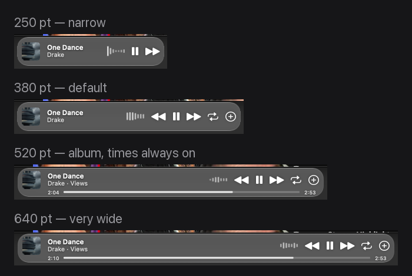
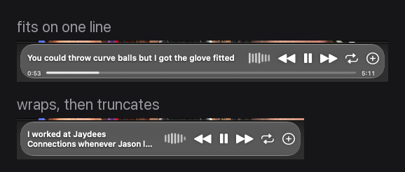
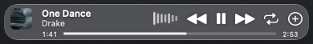
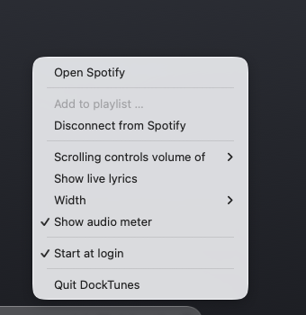
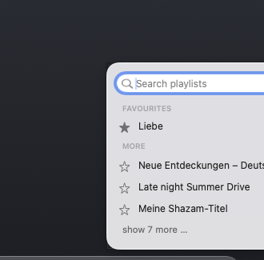

# DockTunes

**A Spotify panel that sits next to the macOS Dock and follows it — as if it were part of it.**


*[Deutsche Fassung](README.de.md) — the German version carries the full measurement notes.*


---

## What it does

- **Looks like the Dock, not like a widget.** The fill is measured against the
  Dock, not guessed: it blends by the same straight rule, in light and dark
  mode, with the same one-point light rim top and bottom and no drop shadow.
  Largest remaining deviation: 6 of 255 steps on the built-in display. The
  glass mixes slightly differently on external screens; `liftLight` adjusts it.
- **Follows the Dock** — its height, its width when it magnifies, across
  displays, and it disappears with it in full screen.
- Cover, title, artist, transport buttons, repeat in three states.
- **All artists, not just the first.** Spotify's scripting interface only
  reports one name — `Rich Baby Daddy (feat. Sexyy Red & SZA)` comes back as
  plain `Drake`. With the web API linked the panel shows the full line,
  `Drake, Sexyy Red, SZA`. Without it, the first name, as before.
- **The cover opens the track**, each artist opens their page in Spotify.
  Neither disturbs playback — Spotify only changes what it shows.
- **Each artist is clickable** and opens their page in Spotify. The one under
  the pointer is underlined — there is no pointing-hand cursor, because only
  the frontmost application may set the cursor and the panel never comes
  forward.
- **Progress bar** with elapsed and total time, draggable to seek.
- **Audio meter** driven by Spotify's real output signal, not a canned loop.
- **Live lyrics** with the running line.
- **Add to a playlist** from a picker of your own playlists.
- Scroll over the panel for volume, in steps of 5.
- German or English, following the system language.
- **Light on the machine.** Measured with `top`, averaged over five samples:

  | State | CPU | Memory |
  |---|---|---|
  | paused | 0.3 % | 14 MB |
  | playing | 1.4 % | 15 MB |
  | playing, pointer on the panel | 2.1 % | 15 MB |
  | lyrics mode, playing | 2.4 % | 14 MB |
  | playing, audio meter off | 0.3 % | 13 MB |

  Memory is flat over time and the only leaks are 9.6 KB inside Apple's XPC
  layer.

## Screenshots

**The wider you make it, the more it shows.** The steps are not round numbers
but tied to the content — each one brings something visible.



**Lyrics.** Only the current line, wrapped across two when it does not fit.



**Hover** brings up the progress bar with elapsed and total time.



| Settings | Playlists |
|---|---|
|  |  |

## Requirements

- macOS 14.2 or newer — the exact Liquid Glass match needs macOS 26, below that
  a fallback material is used
- The Spotify **desktop app** (the web player will not do)
- Xcode Command Line Tools (`xcode-select --install`) — no Xcode project needed

## Install

```bash
git clone https://github.com/Janckii/DockTunes.git
cd DockTunes
bash build.sh
open -a ~/Applications/DockTunes.app
```

`build.sh` compiles the single source file, assembles the bundle in
`~/Applications` and signs it.

### Permissions

On first launch macOS asks for two things:

1. **Accessibility** — the only way to read where the Dock currently sits.
   Without it the panel stays invisible. Restart the app once afterwards.
2. **Control Spotify** — without it DockTunes knows neither the track nor the
   playback state.

The audio meter triggers a third prompt on first playback (recording audio).
It is only analysed; nothing is stored or sent. Turning the meter off avoids
the prompt entirely.

## Using it

| Action | Effect |
|---|---|
| Click the cover | Open the track in Spotify |
| Click an artist | Open that artist in Spotify |
| Click anywhere else on the panel | Bring Spotify to the front |
| Transport buttons | Previous, play/pause, next |
| Repeat button | Off → repeat all → repeat one → off |
| Plus button | Open the playlist picker |
| Pointer on the panel | Progress bar with elapsed and total time |
| Drag on the progress bar | Seek within the track |
| Scroll over the panel | Volume in steps of 5; the bar shows it briefly |
| Right-click | Menu with every setting |

Width is set from the right-click menu under **Width** — four steps, different
ones for normal and lyrics mode. If the title does not fit it scrolls: 20
points per second, 2.5 seconds of stillness before each pass.

## Playlists

The plus button opens the picker every time. There is deliberately no
remembered default: without a choice nobody knows where the track goes. Only
playlists you can actually write to are offered — `me/playlists` also returns
every playlist you merely follow, and Spotify answers a write there with 403.

This needs Spotify's web API and a one-time setup. The same link also gives
the panel the complete artist list, which AppleScript does not know:

1. Create an app on [developer.spotify.com](https://developer.spotify.com/dashboard) (free)
2. Set the redirect URI to exactly `http://127.0.0.1:8888/callback`
3. **Settings → User Management → add yourself**, with your name and the
   e-mail of your Spotify account
4. Copy the client ID and paste it on the first click of the plus button

Sign-in uses PKCE, so no secret lives in the app. Credentials land in
`~/Library/Application Support/DockTunes/credentials.json` with mode 0600.

### If adding fails with 403

Spotify now refuses the documented path `/playlists/{id}/tracks`; its successor
`/items` answers normally. DockTunes uses `/items`. If you build on this code,
that is the reason — same token, same playlist, same body:

| Call | |
|---|---|
| `GET /me`, `/me/playlists`, `/playlists/{id}`, `/search` | 200 |
| `GET`/`POST` `/playlists/{id}/tracks` | **403** |
| `GET /playlists/{id}/items` | **200** |
| `POST /playlists/{id}/items` | **201** |

The other cause is step 3 above: without your account under User Management the
app stays in Spotify's development mode.

## Configuration

Everything from the right-click menu. In addition, via `defaults`:

```bash
defaults write de.jancko.docktunes volumeStep -int 2          # volume per notch (default 5)
defaults write de.jancko.docktunes followRate -int 30         # dock polls per second
defaults write de.jancko.docktunes rimAlpha -float 0.30       # strength of the light rim
defaults write de.jancko.docktunes shadowStrength -float 0.6  # shadows, 0 = off
defaults write de.jancko.docktunes panelWidth -float 460      # width, normal (from 200)
defaults write de.jancko.docktunes lyricsWidth -float 580     # width in lyrics mode
```

If the panel stays invisible, `/tmp/docktunes-status.txt` says why — which
permission is missing, whether Spotify answers, where the Dock was found.

## Contributing

Everything sits in one file, `DockTunes.swift`. No Xcode project, no package
manager — `bash build.sh` is enough. **Source code and comments are in
German**; the user interface is bilingual.

The icon ships as `icon/DockTunes.icns` and is drawn by `icon/icon.swift` — a
small program, no graphics application needed.

Two things that matter when building on this:

- **Measured, not estimated.** Nearly every number in the source (spacings,
  brightnesses, rim strengths) is there because it was measured, and the
  comment beside it says against what. Anyone changing them should measure
  again — a screenshot and a few lines of pixel comparison are enough. The
  [German README](README.de.md) carries the full log.
- **Drawing inside the glass is expensive.** Every `draw(_:)` inside an
  `NSGlassEffectView` re-blends the whole surface — measured at 1.7 ms per
  pass. The audio meter and the progress bar are `CALayer`s for that reason;
  it was worth about five percentage points of CPU.

## Licence

MIT — see [LICENSE](LICENSE).
